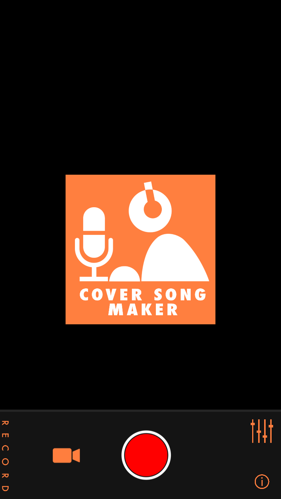

<!-- 내부 링크가 github 페이지에서는 정상적으로 동작을 안하고 있음. -->
<!-- 동작하는 문법을 찾거나, 방법을 찾을 때 까지는 주석처리 -->

#### 지원자 강상우
# 포트폴리오
## 목차
## 1. 참여 프로젝트
<!-- (#1.참여-프로젝트) -->
### &nbsp;&nbsp;ㄱ. 방송 및 공연 환경에서의 각 전문분야의 유기적인 활동을 지원하기 위한 프로그램 군의 개발 (OSX/iOS)
<!-- (#ㄱ.방송-및-공연-환경에서의-각-전문분야의-유기적인-활동을-지원하기-위한-프로그램-군의-개발) -->
### &nbsp;&nbsp;ㄴ. 영상, 음성 분석기술을 이용한 고객 관리 솔루션 시스템 (OSX)
<!-- (#-ㄴ.[영상,-음성-분석기술을-이용한-고객-관리-솔루션-시스템]) -->
### &nbsp;&nbsp;ㄷ. ASMR Director (iOS)
<!-- (#-ㄷ.ASMR-Director) -->
### &nbsp;&nbsp;ㄹ. Chord Player (iOS)
<!-- (#-ㄹ.Chord-Player) -->
### &nbsp;&nbsp;ㅁ. Stdio Recording (iOS)
<!-- (#-ㅁ.Stdio-Recording) -->
### &nbsp;&nbsp;ㅂ. Karaoke Studio (iOS)
<!-- (#-ㅂ.Karaoke-Studio) -->
### &nbsp;&nbsp;ㅅ. Whyme (iOS)
<!-- (#-ㅅ.Whyme) -->
### &nbsp;&nbsp;ㅇ. myOndo (iOS)
<!-- (#-ㅇ.myOndo) -->
### &nbsp;&nbsp;ㅈ. IMU를 활용한 측위 알고리즘 / Firmware 개발 (OSX/ESP32)
<!-- (#ㅈ.IMU를-활용한-측위-알고리즘-/-Firmware-개발) -->
### &nbsp;&nbsp;ㅊ. 기타

## 2. 개인 프로젝트
### &nbsp;&nbsp;ㄱ. FRGame (iOS)
### &nbsp;&nbsp;ㄴ. FRBinder (iOS Swift Library)
## 3. 수상경력
---
---
 
 
 

## 1.참여 프로젝트
#### ㄱ.방송 및 공연 환경에서의 각 전문분야의 유기적인 활동을 지원하기 위한 프로그램 군의 개발
* 프로젝트 개요 : 
    + 중소기업청 창의도전형 SW R&D 지원사업
    + 방송 및 공연 환경에서의 각 전문분야의 유기적인 활동을 지원하기 위한 프로그램 군(5개)의 개발(OSX/iOS 환경)
    + SE(Sound Engine)
        - 소리의 입/출력 관리
        - 최대 16채널 관리
    + VE(Video Engine)
        - 영상의 입력 및 처리
        - GVE 로 입력된 영상을 송출
    + GVE(Graphic Visualization Engine)
        - 각 VE로부터 송출된 영상의 입/출력 관리
        - 최대 8 채널 관리
    + IS(Integraed System)
        - 각각의 SE, VE, GVE 관제
        - 실 공연에 사용하기위한 실행 Queue 관리
    + RCI(Remote Control Interface)
        - iOS 환경에서 IS 와 무선으로 연동되는 컨트롤 인터페이스
    
* 기여 :
    + OpenFrameworks를 이용한 4개 어플리케이션 개발(SE, VE, GVE, IS), iOS 어플리케이션 개발
    + SE 내부 로직을 제외한 모든 부문 개발
    + Kinect 연동
    + 각 어플리케이션간 커뮤니케이션을 위한 Socket 통신부 개발

* 해당 프로그램군을 활용하여 총 3회의 공연 수행
    - 공연 포스터 
    </img>
    </img>
    </img>  
    - 각 어플리케이션의 화면 
    </img>
    </img>
    </img> 
    </img>
    </img>  

    - 공연 장면 
    </img>
***

#### ㄴ.영상, 음성 분석기술을 이용한 고객 관리 솔루션 시스템

* 프로젝트 개요 : 
    + 과학 창의재단 지원사업
    + Keynect를 이용하여 사용자의 얼굴 표정을 추측
    + 사용자의 표정, 음성으로부터 화남의 정도를 분석
    + OSX 환경에서 구동
      
    - 어플리케이션 화면  
    </img> 
***

#### ㄷ.ASMR Director

* 프로젝트 개요 : 
    + 서울시 청년100 지원사업
    + 사용자가 원하는 white noise를 추가하여 자신만의 ASMR을 만들 수 있는 어플리케이션
    + mp3, wav, aiff 등의 음원포맷 지원
    + 각 채널별 Volume/Panning 조절 인터페이스 제공
    + 최대 16개 채널 동시 재생 가능
      
    - 어플리케이션 화면 
    </img>
    </img>
    </img>
***

#### ㄹ.Chord Player

* 프로젝트 개요 : 
    + Chord 기반의 가상 악기 어플리케이션
    + Grand Piano, EP 등 3가지 악기 지원
    + 내부 악보 포맷 지원
    + 악보 작성용 툴 개발(OSX)
    + 개발 중단
      
    - 개발중인 어플리케이션 화면 
    </img>
***

#### ㅁ.Stdio Recording

* 프로젝트 개요 : 
    + 사용자가 추가한 MR을 반주로 하여 동영상 UCC 제작을 도와주는 Application
    + mp3, wav, aiff 등의 음원포맷 지원
    + 3종류의 Reverb 효과 지원
    + 사용자의 선택에 따라 동영상 녹화의 On/Off 설정 가능
      
    - 어플리케이션 화면 
    </img>
    </img>
***

#### ㅂ.Karaoke Studio

* 프로젝트 개요 : 
    + Youtube 동영상을 이용하여 UCC 제작을 도와주는 Application
    + Youtube 동영상중 오디오 채널을 이용하여 MR 생성 및 동영상 촬영시 적용
    + 3종류의 Reverb 효과 지원
    + 사용자의 선택에 따라 동영상 녹화의 On/Off 설정 가능
    + 개발 중단
      
    - 어플리케이션 화면 
    </img>
    </img> 
    </img>
***

#### ㅅ.Whyme

* 프로젝트 개요 : 
    + 구인구직 플랫폼
    + 이력서 / 채용공고 분석을 통해 구인자-구직자 간 매칭
    + 실시간 채팅 제공

* 기여 :
    + 서비스, UI/UX 기획 참여
    + iOS 어플리케이션 구현
    + 문서 유사도 비교 알고리즘 구현
    + 분석서버를 위한 구조 설계 : Redis를 이용한 Message Queue, NodeJS 를 이용한 분석서버 API 개발
      
    - 어플리케이션 화면 
    </img>
    </img>
    </img>
***

#### ㅇ.myOndo

* 프로젝트 개요 : 
    + 에어컨 제어를 위한 iOS 어플리케이션 (IoT)
    + 자체 분석된 IR Code Table
    + 영문, 중문, 일문, 한글 지원
    + 자사 인공지능 엔진을 이용한 온도조절 기능 제공

* 기여 :
    + iOS Application 개발
      
    - 어플리케이션 화면 
    </img>
    </img>
***

#### ㅈ.IMU를 활용한 측위 알고리즘 / Firmware 개발

* 프로젝트 개요 : 
    + 위치추적장치 개발중 Offline 상태에서의 측위/행동 관찰을 위한 알고리즘 개발
    + 차후 생활패턴 작성을 위한 10종의 행동패턴 분류
    + X,Y,Z 축을 기준으로 착용자의 이동거리 계산

* 기여 :
    + ESP32 보드에 MPU9250을 이용하여 측위 알고리즘 구현
    + 시뮬레이션을 위한 OSX Application 개발
    + Matlab을 이용하여 저장된 데이터로 알고리즘 구현
    + Serial/wifi 통신을 이용하여 알고리즘 테스트/모니터링
      
    - 알고리즘 테스트를 위한 어플리케이션 및 실 장비 
    </img> 
    </img>
    </img> 
    </img>
    </img> 
    </img>

* Video 
 [download](https://github.com/krackWingSam/portfolio/raw/master/%EB%B2%95%EB%AC%B4%EB%B6%80/video.mov)  
    [</img>](https://github.com/krackWingSam/portfolio/raw/master/%EB%B2%95%EB%AC%B4%EB%B6%80/video.mov)  
---    

#### ㅊ. 기타
* 나비링크 (iOS) 
    </img>
    </img>
    </img>

* 아바타 빈즈 (iOS) 
    </img>
    </img>
    </img> 

* 경동 온수매트 (iOS) 
    </img>
    </img>
    </img>

* 입자 (iOS) 
    </img>
    </img>
    </img>

* 경동 홈오토 (iOS) 
    </img>
    </img>
    </img>

* 한마루 (iOS) 
    </img>
    </img>
    </img>

---

## 2.개인 프로젝트
#### ㄱ.FRGame (iOS)
* 프로젝트 개요 : 
    + Drag 를 이용한 간단한 퍼즐 게임
* 개발 진행사항 : 
    + swift 로 변환 완료
    + Interaction 부문 개발 완료
    + Animation 부분 구현 필요
    + 게임 내부 시스템중 각 Phase 의 명확한 기획 필요
* [git Link](https://github.com/krackWingSam/FRGame01/tree/swift)
---

#### ㄴ.FRBinder (iOS Swift Library)
* 프로젝트 개요 : 
    + Notification을 이용한 Model 객체와 UI 객체의 연결을 위한 라이브러리
    + ViewController 클래스의 코드 정리를 위해 개발
    + 특히 IoT 어플리케이션의 경우, 서버 혹은 디바이스로부터 받는 정보의 UI 출력을 위한 구문들이 복잡해지고, 해당 코드의 분리가 어렵기 때문에 라이브러리 제작
* 특징 : 
    + ViewController 의 Life Cycle 에 맞추어 Bind와 Release 호출
    + Protocol-Delegate 패턴으로부터 오는 코드 복잡도를 줄일 수 있음
    + 각 UI에 출력하기 위한 데이터 모델의 정제를 함수부로 구분하여 사용 가능
    + UITextField 를 사용하는 경우 로직내의 버그가 존재
* 추가 개발 필요사항 : 
    + 디버그를 쉽게 하기위한 추가 구현 필요 (Model, UI 객체의 메모리 추적을 위한 내부 변수 추가 필요)
    + 모델의 변수 타입 구체화
    + 라이브러리 생성시 shell script 구문 불안정 (시뮬레이터를 Target으로 둔 경우)
* [git Link](https://github.com/krackWingSam/FRBinder)
---

## 3. 수상경력
|수상명||수여기관|수상일|
|--|--|--|--|
|제 1회 기술사업화 경진대회|장려상|한국인터넷진흥원|2011.12.07|
|제 7회 교내 소프트웨어 경진대회|도전상|한국산업기술대학교|2012.12.17|
|제 1회 창의도전형 SW R&D 프로그램|우수상|지식경제부|2012.12.30|
|제 6회 교내 소프트웨어 경진대회|혁신상|한국산업기술대학교|2011.11.17|
|제 23회 글로벌 소프트웨어공모대전 응용 SW부문|은상|지식경제부|2011.11.24|
|2011 실전 창업리그 경기 예선|금상|중소기업청|2011.05.30|

<!-- </img>
</img>
</img>
</img>
</img> -->